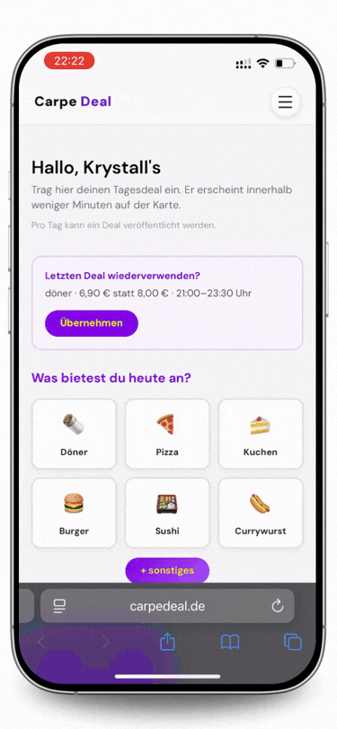
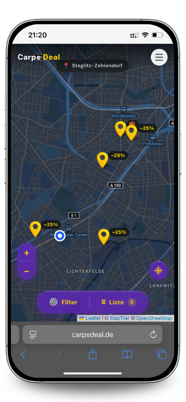

# Carpe Deal 🍽️

Fullstack-Web-App für tagesaktuelle Gastro-Deals in Berlin. Restaurants können eigene Angebote veröffentlichen, die Nutzer anschließend über eine interaktive Karte entdecken können.

🌍 **[carpedeal.de](https://carpedeal.de)**

> Der Produktionscode ist privat. Dieses Repository enthält ausgewählte, vereinfachte Codeausschnitte und technische Einblicke in die Umsetzung.



_Restaurant-Perspektive: Deal erstellen und veröffentlichen → anschließend die Darstellung des veröffentlichten Deals für Nutzer._

---

## Überblick

**Für Nutzer**

- Tagesaktuelle Deals auf einer interaktiven Karte
- Filter nach Kategorie und Standort
- Responsive Oberfläche mit Touch-Navigation auf Mobile

**Für Restaurant-Partner**

- Deals erstellen, bearbeiten und entfernen
- Token-basierter Zugang
- Serverseitige Validierung und Business-Regeln

**Meine Rolle:** Fullstack Development – Frontend, API, Datenbankanbindung und externe Integrationen.

### Tech Stack

**Frontend:** Next.js 16 · React 19 · TypeScript · Tailwind CSS · React Leaflet · MapTiler  
**Backend:** Next.js Route Handlers · REST API · PostgreSQL · Supabase  
**Integrationen:** Telegram Bot API · Resend (E-Mail) · Vercel

---

## Architektur

```text id="9ntv28"
Browser
   │
   ▼
Next.js / React ──────────────► MapTiler
   │
   │ REST
   ▼
Next.js Route Handlers
   │
   ├────────► Telegram Bot API
   ├────────► Resend
   │
   ▼
Supabase / PostgreSQL
```

---

## Code Highlights

**Die folgenden Beispiele basieren auf dem Produktionscode und wurden für dieses Showcase gekürzt und teilweise vereinfacht.**

### 1. Deal Creation – Validation & Business Logic

Die API validiert eingehende Daten serverseitig, authentifiziert den Restaurant-Partner und setzt die Geschäftsregeln unabhängig vom Frontend durch.

```typescript id="87pm4f"
if (!ALLOWED_CATEGORIES.includes(category)) {
  return NextResponse.json({ error: "Ungültige Kategorie" }, { status: 400 });
}

if (time_end <= time_start) {
  return NextResponse.json(
    { error: "Endzeit muss nach Startzeit liegen" },
    { status: 400 }
  );
}

// Restaurant authentifizieren
const { data: restaurant } = await supabaseAdmin
  .from("restaurants")
  .select("id, name")
  .eq("token", token)
  .single();

if (!restaurant) {
  return NextResponse.json({ error: "Ungültiger Token" }, { status: 401 });
}

// Maximal ein Deal pro Berliner Kalendertag
const today = getTodayBerlin();

const { data: existingDeal } = await supabaseAdmin
  .from("deals")
  .select("id")
  .eq("restaurant_id", restaurant.id)
  .eq("valid_date", today)
  .maybeSingle();

if (existingDeal) {
  return NextResponse.json(
    { error: "Für heute wurde bereits ein Deal veröffentlicht." },
    { status: 409 }
  );
}
```

**Warum wichtig?**  
Die Produktregeln liegen im Backend und können nicht durch manipulierte Frontend-Anfragen umgangen werden. Der Geschäftstag wird außerdem explizit für `Europe/Berlin` berechnet und hängt nicht von der Server-Zeitzone ab.

---

### 2. Authentication vs. Authorization

Ein gültiger Restaurant-Token allein berechtigt nicht dazu, beliebige Deals zu verändern.

```typescript id="rz4slz"
const { data: restaurant } = await supabaseAdmin
  .from("restaurants")
  .select("id")
  .eq("token", token)
  .single();

if (!restaurant) {
  return NextResponse.json({ error: "Ungültiger Token" }, { status: 401 });
}

// Deal muss zusätzlich zum Restaurant gehören
const { data: deal } = await supabaseAdmin
  .from("deals")
  .select("id, title, time_start, time_end")
  .eq("id", deal_id)
  .eq("restaurant_id", restaurant.id)
  .maybeSingle();

if (!deal) {
  return NextResponse.json(
    { error: "Deal nicht gefunden oder keine Berechtigung" },
    { status: 403 }
  );
}
```

**Warum wichtig?**  
Die API trennt **Authentication** (wer stellt die Anfrage?) von **Authorization** (darf dieses Restaurant genau diesen Deal verändern?).

---

### 3. Deal Lifecycle & Audit Log

Vor Beginn kann ein Restaurant seinen Deal bearbeiten. Sobald er gestartet ist, werden zentrale Eigenschaften wie Preis, Kategorie und Startzeit geschützt.

```typescript id="x27xjc"
const dealEverStarted = Boolean(deal.first_started_at);

const dealStartingNow =
  !dealEverStarted && currentTimeInMinutes >= startTimeInMinutes;

if (dealStartingNow) {
  await supabaseAdmin
    .from("deals")
    .update({
      first_started_at: new Date().toISOString(),
    })
    .eq("id", deal_id);
}

const dealStarted = dealEverStarted || dealStartingNow;

if (dealStarted && protectedFieldsChanged) {
  return NextResponse.json(
    {
      error: "Nach Dealstart können diese Angaben nicht mehr geändert werden.",
    },
    { status: 403 }
  );
}
```

Änderungen werden zusätzlich mit alten und neuen Werten protokolliert:

```typescript id="h7xqg3"
await supabaseAdmin.from("deal_edits").insert({
  deal_id,
  restaurant_id: restaurant.id,
  changed_fields: changedFields,
  old_values: oldValues,
  new_values: newValues,
});
```

**Warum wichtig?**  
`first_started_at` speichert den tatsächlichen Lifecycle-Zustand. Ein bereits gestarteter Deal kann dadurch nicht durch eine nachträgliche Änderung der Startzeit wieder zu einem „nicht gestarteten“ Deal werden. Gleichzeitig bleiben Änderungen nachvollziehbar.

---

### 4. External API & Retry Handling

Nach einer erfolgreichen Deal-Erstellung wird eine Telegram-Benachrichtigung angestoßen. Fehler des externen Dienstes sollen die eigentliche Veröffentlichung nicht verhindern.

```typescript id="pmj0o5"
async function sendTelegramNotification(message: string) {
  for (let attempt = 1; attempt <= 3; attempt++) {
    try {
      const response = await fetch(telegramApiUrl, {
        method: "POST",
        headers: { "Content-Type": "application/json" },
        body: JSON.stringify({
          chat_id: process.env.TELEGRAM_CHAT_ID,
          text: message,
        }),
      });

      if (response.ok) return;

      console.error(`Telegram attempt ${attempt} failed: ${response.status}`);
    } catch (error) {
      console.error(`Telegram attempt ${attempt} failed`, error);
    }

    if (attempt < 3) {
      await new Promise((resolve) => setTimeout(resolve, 1000 * attempt));
    }
  }
}
```

**Warum wichtig?**  
Externe Services werden von der Kernfunktion getrennt. Eine fehlgeschlagene Telegram-Anfrage macht einen erfolgreich erstellten Deal nicht ungültig. Temporäre HTTP- oder Netzwerkfehler werden über einfache Retries abgefangen.

---

## Interaktive Karte

Die Deal-Karte basiert auf **React Leaflet und MapTiler** und verbindet die geografische Darstellung mit der Deal-Liste.



_Nutzer-Perspektive: Aktuelle Deals werden direkt bei den jeweiligen Restaurants auf der Karte angezeigt._

- Restaurant-Marker für aktuelle Deals
- Synchronisierung von Deal-Auswahl und Karte
- Nutzerstandort und Karten-Bounds
- Filterung nach Standort und Kategorie
- Angepasste Interaktion für Desktop und Mobile

---

## Technische Entscheidungen

**Berliner Kalendertag**  
Die Regel „ein Deal pro Restaurant pro Tag“ richtet sich nach dem Geschäftstag in Berlin. Datumsabhängige Logik verwendet deshalb explizit `Europe/Berlin`.

**Ressourcenbasierte Autorisierung**  
Update- und Delete-Anfragen prüfen nicht nur den Partner-Token, sondern zusätzlich die Zugehörigkeit des Deals zum Restaurant.

**Deal-Zustand nach dem Start**  
Ein persistierter `first_started_at`-Wert verhindert, dass bereits gestartete Deals durch spätere Änderungen wieder in einen vorherigen Zustand versetzt werden.

---

🌍 **[Carpe Deal live ansehen →](https://carpedeal.de)**

**Solo-Projekt · Fullstack Development · Next.js · TypeScript · PostgreSQL**
